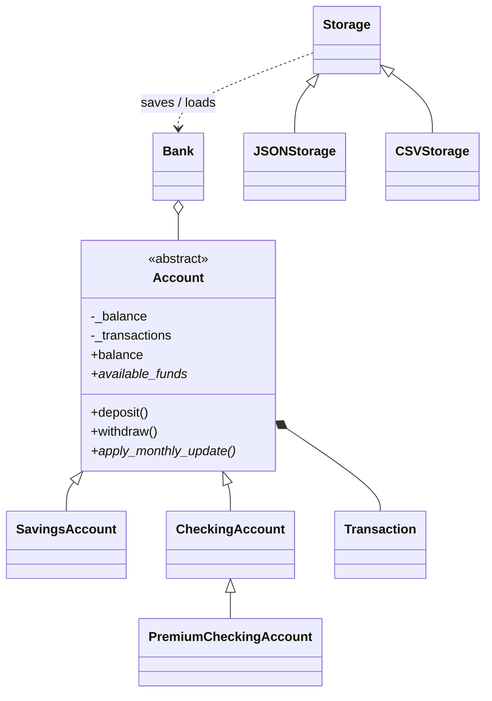

# *Banking Ledger*

[](../../actions/workflows/tests.yml)

An object-oriented data-management engine in Python that models a banking ledger.
It demonstrates **inheritance, encapsulation, polymorphism, custom exceptions,
JSON/CSV persistence and a pytest suite with 100% coverage**.

## Features

- Class hierarchy of accounts (savings, checking, premium checking) managed by a `Bank`
- Exact money arithmetic with `Decimal` (never floats), validated to 2 decimal places
- Immutable, auditable transaction history with running balances
- Safe transfers: every check happens before any balance changes
- Custom exception hierarchy - one `except LedgerError` catches everything
- Persistence to **JSON** (single file, atomic write) and **CSV** (`accounts.csv` + `transactions.csv`)
- Integrity checks on load: tampered or inconsistent balances are rejected

## *Project layout*

```
src/ledger/
├── exceptions.py   # custom exception hierarchy
├── money.py        # Decimal validation helpers
├── models.py       # Transaction (immutable dataclass) + TransactionType enum
├── accounts.py     # Account ABC and subclasses
├── bank.py         # Bank engine (registry, transfers, month-end processing)
└── storage.py      # Storage interface + JSONStorage + CSVStorage
tests/              # pytest suite (161 tests)
demo.py             # runnable walkthrough
```

## Design



| Concept | Where it appears |
|---|---|
| **Abstraction** | `Account` and `Storage` are abstract base classes; subclasses must implement the abstract members. |
| **Encapsulation** | Balance and history are private; exposed via read-only properties. All balance changes go through one private method (`_post`). `transactions` returns a tuple copy. |
| **Inheritance** | `PremiumCheckingAccount` → `CheckingAccount` → `Account`, reusing deposit/withdraw/serialisation. |
| **Polymorphism** | `withdraw()` is a template method using each subclass's `available_funds` (min-balance vs. overdraft). `Bank.apply_monthly_updates()` calls the same method on every account; savings earn interest, checking pays fees. `JSONStorage`/`CSVStorage` are interchangeable. |

## Custom exceptions

```
LedgerError
├── InvalidAmountError        (also a ValueError)  bad amount / rate / precision
├── InvalidAccountDataError   (also a ValueError)  malformed or inconsistent data
├── InsufficientFundsError                          carries account_id, requested, available
├── AccountNotFoundError
├── DuplicateAccountError
├── InvalidTransferError
└── StorageError
    └── UnsupportedFormatError
```

Low-level errors (`OSError`, `JSONDecodeError`, `csv.Error`, `InvalidOperation`) are
caught at the boundary and re-raised as domain exceptions with clear messages.

## Getting started

```bash
git clone <your-repo-url> && cd banking-ledger
python -m venv .venv && source .venv/bin/activate   # Windows: .venv\Scripts\activate
pip install -e . -r requirements-dev.txt

python demo.py                                       # see it run
pytest --cov=ledger --cov-report=term-missing        # run tests + coverage
```

### Usage

```python
from ledger import Bank, InsufficientFundsError, get_storage

bank = Bank("My Bank")
bank.create_account("savings", "SAV-1", "Alice", initial_deposit="1000", interest_rate="0.05")
bank.create_account("checking", "CHK-1", "Alice", initial_deposit="200", overdraft_limit="100")

bank.transfer("SAV-1", "CHK-1", "150")
bank.apply_monthly_updates()

try:
    bank.get_account("CHK-1").withdraw("10000")
except InsufficientFundsError as e:
    print(e.requested, e.available)

get_storage("json").save(bank, "data/bank.json")
get_storage("csv").save(bank, "data/bank_csv")     # writes a folder
restored = get_storage("json").load("data/bank.json")
```

## Notes and limitations

- CSV does not store the bank's display name; on load it defaults to the folder name.
- The CSV format writes two files, so it is not atomic across both (JSON is).
- Not thread-safe; intended as a single-process engine.
